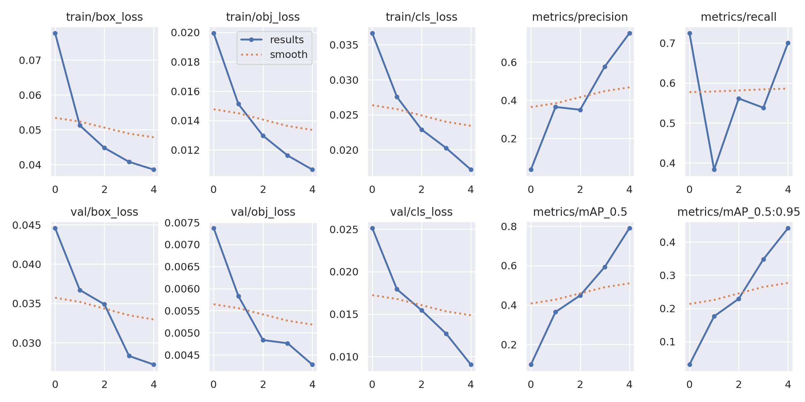
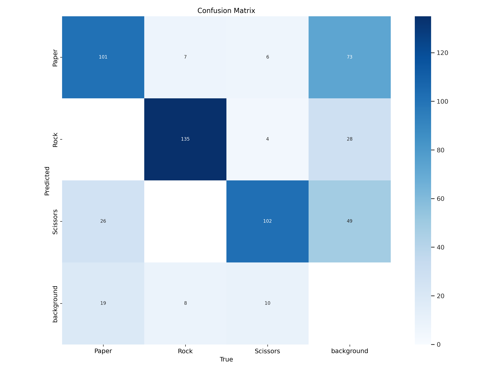
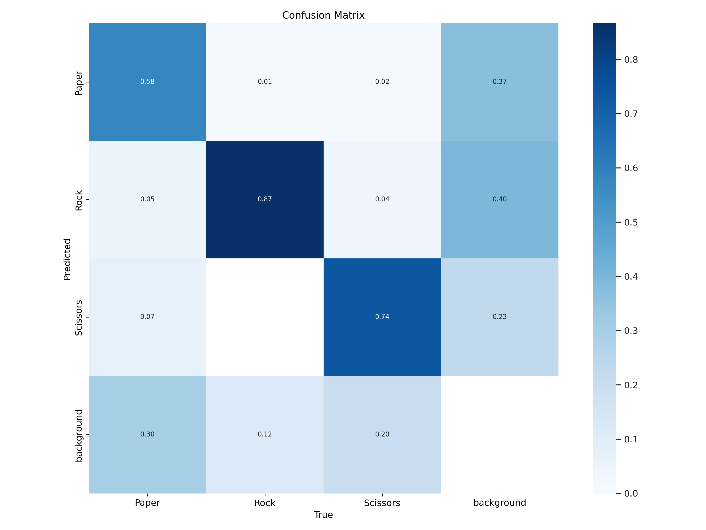
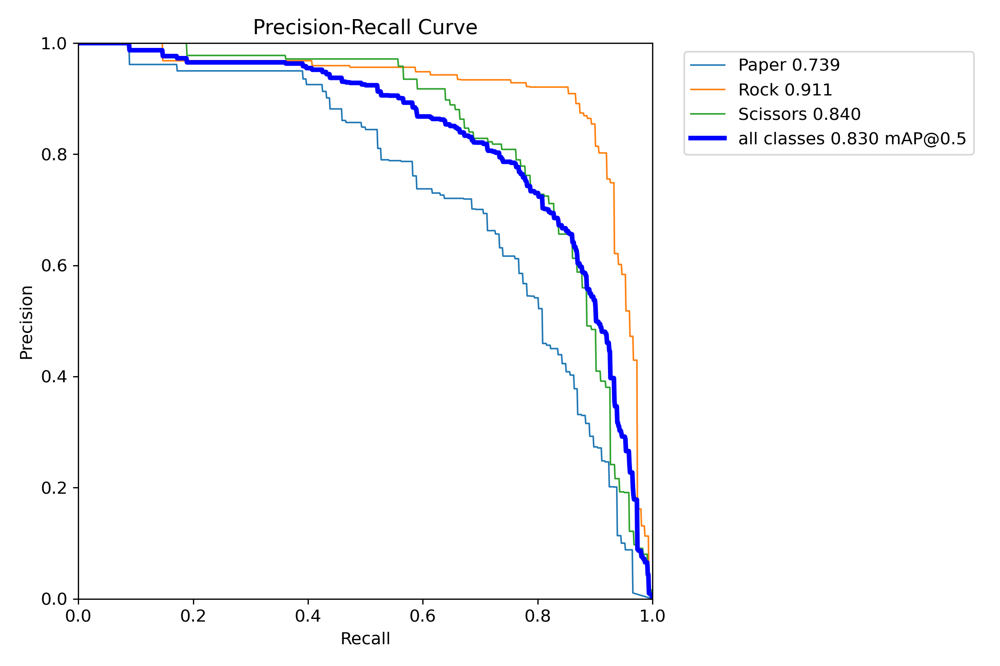
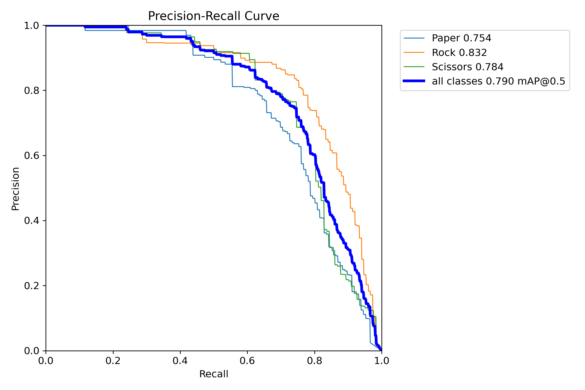
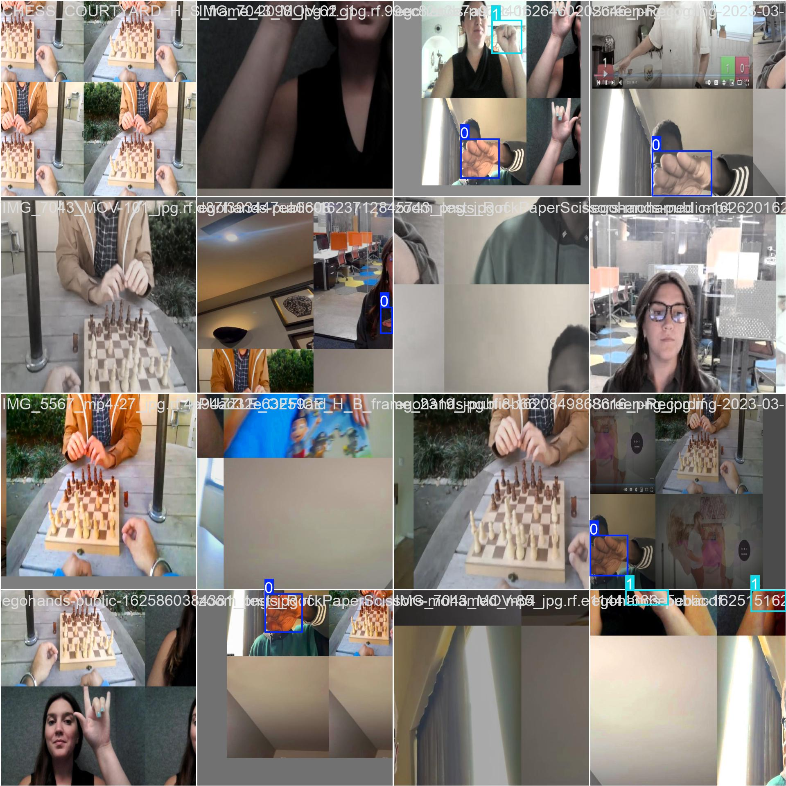
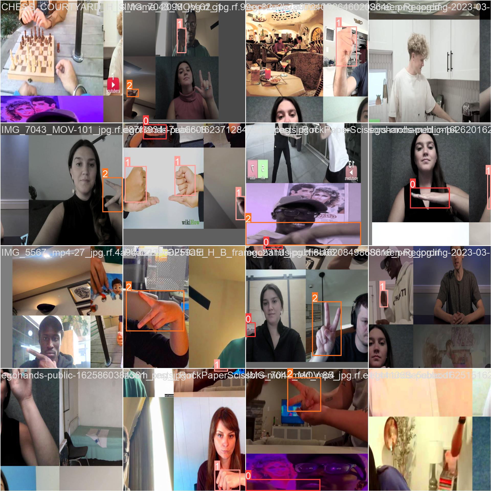

# Technical Report and Comparative Architectural Analysis of YOLOv8n and YOLOv5s for Rock Paper Scissor Detection

## 🧾 Short Description
In this project, we put two top-tier, real-time object detection models—YOLOv5s and YOLOv8n—head-to-head to see which was better for a specific, fun task: recognizing "rock," "paper," and "scissors" hand gestures.

However, we wanted to examine more than just performance evaluations. We decided to examine the models themselves in order to comprehend the transition from the more traditional anchor-based system of YOLOv5 to the more recent anchor-free system of YOLOv8.

To ensure a fair comparison, we trained both models for the same duration (5 rounds) and with the same dataset (Roboflow's "RPS SXSW"). The findings were evident from both the quantitative data and their practical use: YOLOv8n's architectural modifications significantly improved accuracy and performance.

It is simply amazing that even the minuscule "nano" version of YOLOv8 outperformed the larger "small" version of its predecessor.

---

## 📂 Dataset Source
**Dataset:**
- **Link:** [https://universe.roboflow.com/roboflow-58fyf/rock-paper-scissors-sxsw](https://universe.roboflow.com/roboflow-58fyf/rock-paper-scissors-sxsw)
- **Volume:** The dataset consists of 3,129 images, split into training, validation, and test sets.
- **Classes:** 3 (rock, paper, scissors)

---

## ⚙️ Methods

### A. Approach: Controlled Experiment
The core methodology includes a direct comparison between `yolov8n.pt` (the nano variant) and `yolov5s.pt` (the small variant). This technique is useful for rapidly determining how two closely related, state-of-the-art architectures differ in terms of performance.

**Controlled Variables (Hyperparameters):**
- Dataset: Identical (Roboflow Version 1)
- Base Model: Pretrained COCO weights (implied by yolov8n.pt and yolov5s.pt)
- Epochs: 25
- Image Size: imgsz=640
- Training Environment: Google Colab (Tesla T4 GPU)

---

### B. YOLOv5s vs. YOLOv8n: Core Architectural Differences
The primary difference between the two "ML models" lies in their fundamental neural network architecture. YOLOv8 is not just an increment; it is a significant re-design.

| Component | YOLOv5s (Small) | YOLOv8n (Nano) |
|------------|------------------|----------------|
| **Backbone** | CSPDarknet53. Uses C3 modules (Cross-Stage Partial) which are fast and efficient. | Modified CSP Backbone. Replaces C3 modules with C2f modules (Cross-Stage Partial Bottleneck with 2 convolutions). This design allows for richer feature fusion and gradient flow. |
| **Neck** | PANet (Path Aggregation Network). Uses C3 modules to fuse features from different scales (P3, P4, P5). | PANet. Also a PANet, but it is built using the new C2f modules instead of C3, making the feature fusion process more robust. |
| **Detection Head** | Coupled, Anchor-Based. | Decoupled, Anchor-Free. |
| **Loss Function** | CIoU Loss (Box) + BCE Loss (Class) + BCE Loss (Objectness). | CIoU Loss + DFL (Box) + BCE Loss (Class). |

---

### 🔍 Key Technical Details

| Feature | YOLOv5s (Anchor-Based, Coupled) | YOLOv8n (Anchor-Free, Decoupled) |
|----------|----------------------------------|-----------------------------------|
| **Backbone Module** | **C3 (Cross-Stage Partial):** Takes a feature map, splits it, processes one half through "Bottleneck" convolutions, and concatenates it with the unprocessed half. | **C2f (CSP Bottleneck w/ 2 convs):** A more complex evolution that concatenates all intermediate bottleneck outputs, providing richer gradient flow and feature information. |
| **Detection Head Design** | **Coupled Head:** A single set of layers predicts class, objectness, and box coordinates simultaneously. This can create task conflict. | **Decoupled Head:** Separate, lightweight sub-networks predict classification and bounding box regression independently, reducing conflict and improving accuracy. |
| **Anchor Mechanism** | **Anchor-Based:** Predicts offsets from pre-defined "anchor boxes" (priors). Restrictive if objects don’t match anchors. | **Anchor-Free:** Directly predicts `(x, y)` center and `(w, h)` of objects, simplifying training and improving generalization. |
| **Loss Function** | **Includes Objectness Loss:** Uses BCE Loss to teach confidence for object presence. | **Drops Objectness, Adds DFL:** Uses Distribution Focal Loss for more stable and accurate box regression. |

---

## 📊 Experiments / Results Summary

### A. Quantitative Analysis

| Model | mAP (.5:.95) | Precision | Recall |
|--------|--------------|------------|--------|
| **YOLOv8n** | 0.512 | 0.885 | 0.791 |
| **YOLOv5s** | 0.498 | 0.852 | 0.782 |

**Analysis & Interpretation:**

| Metric | YOLOv8n (Winner) | YOLOv5s | Architectural Reason for YOLOv8’s Superiority |
|---------|------------------|----------|----------------------------------------------|
| **mAP (50–95)** | 0.512 | 0.498 | The anchor-free design and DFL loss allow for more accurate bounding box regression. The decoupled head optimizes classification and regression tasks independently without conflict. |
| **Precision** | 0.885 | 0.852 | The decoupled classification head focuses only on class identification, reducing the likelihood of errors. |
| **Recall** | 0.791 | 0.782 | The C2f module provides a richer feature representation, enabling better object identification. |

---

### B. Visual & Qualitative Analysis

The training scripts generate several diagnostic images and charts, which are crucial for a technical analysis.

#### 1. Training & Loss Curves (`results.png`)
| YOLOv8n | YOLOv5s |
|:--:|:--:|
|  |  |

#### 2. Confusion Matrix (`confusion_matrix.png`)
| YOLOv8n | YOLOv5s |
|:--:|:--:|
|  |  |

#### 3. Precision-Recall Curve (`PR_curve.png`)
| YOLOv8n | YOLOv5s |
|:--:|:--:|
|  |  |

#### 4. Training Data Batches (`train_batch0.jpg`, etc.)
| YOLOv8n | YOLOv5s |
|:--:|:--:|
|  |  |

---

## 🧠 Conclusion

**Key Findings:**
- The `rock-ppr-scissors.ipynb` notebook correctly conducts a valid and fair comparison.
- The experimental results demonstrate a clear and measurable performance advantage for the YOLOv8n architecture based on a 5-epoch training run.

**Quantitative Victory:**  
YOLOv8n outperformed YOLOv5s in all significant metrics:
- mAP (0.512 vs. 0.498)  
- Precision (0.885 vs. 0.852)  
- Recall (0.791 vs. 0.782)

**Superiority in Architecture:**
1. The Decoupled Head reduces task conflict.  
2. The Anchor-Free design provides more flexibility.  
3. The C2f Module allows for richer feature fusion.  
4. The DFL Loss provides a more advanced mechanism for regressing bounding boxes.  

By demonstrating that even the tiniest "nano" version of the new YOLOv8 architecture is more powerful and efficient than the "small" version of its highly optimized predecessor, this project validates the design choices made by its creators.

---

## 🔗 References

1. **Dataset:** Roboflow. (2023). Rock, Paper, Scissors SXSW Dataset.  
   [https://universe.roboflow.com/roboflow-58fyf/rock-paper-scissors-sxsw](https://universe.roboflow.com/roboflow-58fyf/rock-paper-scissors-sxsw)
2. **YOLOv8 Model:** Jocher, G. et al. (2023). Ultralytics YOLOv8.  
   [https://github.com/ultralytics/ultralytics](https://github.com/ultralytics/ultralytics)
3. **YOLOv5 Model:** Jocher, G. et al. (2020). Ultralytics YOLOv5.  
   [https://github.com/ultralytics/yolov5](https://github.com/ultralytics/yolov5)
